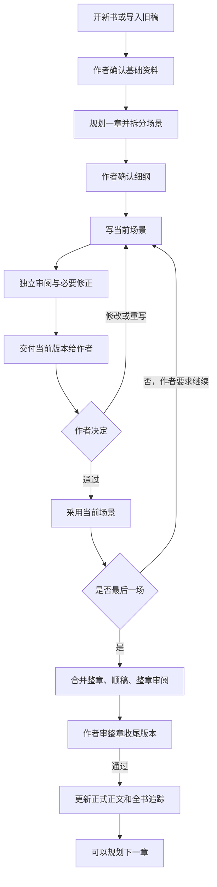

# novel-kit 当前工作指引

本文依据共享规则、六个 skill 和本地命令整理。所有新输出内容使用简体中文；路径保留项目现有真实名称。实际配置、测试和品质结果以本次核对为准，不把旧快照当成当前验收。

## 1. 框架是什么

这是一个由作者把关的小说协作框架。一本书使用一个独立工作目录。先建立或导入资料，再规划章节，把章节拆成场景；每次写一个场景，经过独立审阅和必要修正，交作者决定是否采用。所有场景采用后，再审整章并正式采用。



“通过”后通常停下；“通过，继续”才继续下一场。最后一场采用后会准备整章收尾交付，整章仍要另行确认。

## 2. 谁负责什么

| 参与者 | 职责 |
|---|---|
| 作者，也就是你 | 决定题材、情节、重要设定、修改范围，以及采用哪个具体版本 |
| 主会话协调器 | 读取当前状态、选择 skill、准备资料、调用角色、汇总问题、执行采用与恢复 |
| scene-writer | 写一个场景或修改指定候选，不直接覆盖正式正文 |
| copy-editor | 隔离作者意图，只读允许的正文和规范，检查理解、病句、指代与衔接 |
| consistency-checker | 核对事实、时间、知情、资源、道具流转，分析修订影响 |
| character-reviewer | 检查对话、动机、声线和关系推进 |
| prose-reviewer | 检查套话、解释腔和文风自然度 |
| structure-reviewer | 检查场景功能、细纲要求和兑现，也检查开书设定 |
| chapter-extractor | 导入旧稿时按章抽取事件与事实，附原文证据 |

新场景通常由五位审阅者检查；纯文字修订由文字编辑和一致性检查员检查；整章收尾由文字、事实、结构三位检查。盲读每轮使用新独立上下文。

独立审阅缺席时，要明确报告“审阅不完整”，不能用主会话自审冒充独立审阅。模型审阅意见不等于作者采用或真人阅读验证。

## 3. 六个 skill 怎样选择

可以直接用自然语言，不必记住命令。Claude Code 支持相应斜线入口；Codex 可以使用已加载的技能入口或自然语言。

| 你的情况 | skill | 可以直接说的话 |
|---|---|---|
| 从零开始一本书 | new-book | “开一本新书，题材是……先建立设定、人物和第一卷方向。” |
| 已经有小说原稿 | import-book | “导入这份原稿：〈路径〉。先备份和重建资料，不修改原文。” |
| 准备写下一章 | plan-chapter | “规划第012章，先检查到期伏笔和兑现，再拆场景，给我确认。” |
| 细纲确认后写正文 | write-scene | “按已确认细纲写下一场，完整审阅后交给我。” |
| 修改已采用内容 | revise | “修改第012章的这段对话，只改表达，不改变事实，先交候选。” |
| 集中精修一幕 | fiction-scene-polishing | “逐幕检查这段的对白、动作和道具衔接，先只报告问题。” |

已采用正文的精修需要结合 revise 的任务、候选和采用流程执行。待审候选的修改继续走 write-scene，不另开正文修订。

## 4. 开始使用前

把完整工具组放在书稿工作目录中，保留隐藏的 `.agents` 和 `.novel-kit`。已有其他写作工具的书稿，按当前 README 建议另建目录并导入，避免混用状态。

首次使用让协调器按实际宿主配置即可。例如在 macOS 上只使用 Codex：

```sh
./novel setup --agent codex
./novel doctor --agent codex
```

只使用 Claude Code 就把 `codex` 换成 `claude`；确实同时使用两者时用 `all`。其他本地 Agent 用 `generic`。Windows PowerShell/CMD 将 `./novel` 换成 `.\novel.cmd`。核心需要可用的 Python 3.9+。

移动目录或切换操作系统后重跑配置。适配文件由共享来源生成，不手改适配副本。宿主还需要加载并信任相关 Hook；doctor 不能证明宿主已经信任它。

这些命令通常由协调器执行。你不需要手填 JSON、维护状态表或自己操作采用命令。

## 5. 新书怎么用

1. 说明题材、读者、主角处境、主要冲突、世界规则和第一卷目标；已有资料可以直接指定文件。
2. 提供自己认可的文风样本，或者指定已有原文。没有样本时先标待补，不让 AI 自己生成样本当标准。
3. 用 new-book 建立资料，审查待确认事项；由你决定重要设定。
4. 用 plan-chapter 规划第一章，审查场景安排与兑现。
5. 明确回复“确认这份细纲”。协调器登记版本后，才开始 write-scene。

全书和分卷方向可以提前建立；当前逐章规划入口要求上一章收尾或导入确认完成，不能把它理解成已实现任意多章细纲并行确认。

## 6. 已有书稿怎么用

说明原稿路径、完整范围、残稿位置，以及接下来要续写还是修改。长书可以选择全量详细抽取，或近期详细抽取、早期摘要，但必须明确实际覆盖。

导入流程会备份原稿、整理章节、按章抽取事实、重建设定和追踪，再交你确认冲突与推断。原稿备份不可改删。正文文件已经存在，也不代表导入确认已经完成。

全书体检是可选工作，需要你明确要求；体检先报告问题，再由你选择修订范围。

## 7. 日常写作怎么用

每章按下面的顺序操作：

1. 说“规划下一章”。先看本章目标、场景安排、到期伏笔和兑现处置。
2. 确认细纲，或者提出具体调整。
3. 说“写下一场”。协调器核对状态，写手产出候选，审阅者独立检查。
4. 协调器在对话展示本场完整候选和详细对照；长稿打开含全文的交付，同时逐条展示原句、改句、理由、问题证据、保留项、事实/资源/道具/知情/兑现变化、完成或缺席、范围与分歧。不能只报路径、计数或结论。
5. 明确决定采用、修改或重写。
6. 最后一场采用后，另审整章收尾交付。整章通过才更新正式正文与全书追踪。

| 你的回复 | 协调器接下来做什么 |
|---|---|
| “通过” | 采用当前明确版本，通常停下 |
| “通过，继续” | 采用后推进下一场；末场转入收尾 |
| “修改：……” | 使旧交付失效，按意见修改候选，再审阅交付 |
| “重写：……” | 按新方向重写，再完整审阅 |
| “先不改，只检查……” | 只报告问题，不改正文、设定、追踪或报告文件 |

“继续”本身不代表采用待审稿。“还行”“差不多”也不能代替明确通过。存在多个待审版本时，要说清章、场和版本。

新场景、重写通常最多两轮自动修正；待审稿局部修改最多一轮。只自动修正有证据且在授权内的严重问题；审阅分歧、重要情节变更和未解决问题交作者决定。

## 8. 已采用内容怎么修改

说明目标章、段落、修改要求和保留项。只改措辞是文字修订；改变事件、知情、关系、设定或兑现属于情节修订，需要先检查后续依赖。

修订建立任务，在独立候选上修改，**每次只优化一场并详细交你审核**；通过并继续才处理下一场。整章的场景确认只确认对应候选，不把片段覆盖整章。全部场景确认后合成完整目标，保留独立整章盲读，再由你采用完整章版本。所有目标采用后仍需追踪和事实同步收尾，在此之前暂停续写。

你自己手改后，可以说：“我手改了第012章，只审阅目前版本，不要自动改。”协调器保留你的当前稿，按可核实的旧版本比较。没有旧基准就明确报告缺失，不虚构改前内容。

暂停后回来，可以说：“先检查当前状态，告诉我停在哪里，再恢复已有任务。”协调器先看待审交付、修订任务和采用记录，不直接跳到下一场。需先修前场时，可明确要求撤回当前工作单元；工具保留稿件和历史，前置修订仍须完成。已开始章改变细纲时，完成影响复核后重新确认绑定版本。

## 9. 你主要看哪些文件

| 用途 | 当前路径 |
|---|---|
| 设定、角色、文风、兑现 | `設定/` |
| 全书方向和章内场景安排 | `大綱/` |
| 当前全书事实与场景工作状态 | `追蹤/` |
| 场景候选和整章候选 | `草稿/` |
| 已正式采用的章节 | `正文/` |
| 作者交付、审阅结果、修订与采用记录 | `審閱/` |
| 原稿备份和抽取资料 | `導入/` |

日常优先打开当前交付文件，不要把草稿目录里任何新文件都当作正式正文。场景采用保存章内事实增量；整章采用才同步全书状态。

## 10. 怎样核对实际完成程度

| 核对对象 | 查看依据 | 结论边界 |
|---|---|---|
| 六个 skill、七个角色与逐场交付 | 共享来源、当前交付和独立执行记录 | 规则存在不证明文学质量 |
| 版本、撤回、细纲重绑与恢复 | 本轮测试结果、实际 journal 与任务 | 参数记录不证明真人授权 |
| 前文供给 | 上下文清单、来源身份、prose_ranges、writer/blind 包 | 工具核对版本，必要前因仍由协调器按证据选择 |
| 适配部署 | setup --check、doctor、宿主信任与实际加载 | 不固定写入容易漂移的待同步文件数量 |
| 品质改进 | 修后独立盲读、单次稳定性、未参与规则设计的保留样本 | 静态门禁或合并指标不能证明单次品质 |
| 系统和宿主兼容 | Windows 原生与 Claude/Codex 实际会话记录 | macOS 测试不能替代其他环境验收 |

前文使用叙事顺序直接前场全文＋必要前因原文；写手与文字编辑同范围冻结，写手另收最新累计事实。跨章只用最新正式正文，边界不可靠给上一章全文；缺前因先补原文重新盲读。适配变更后同步、重新加载并核对信任，具体工程与品质覆盖见验证记录。

## 11. 可以直接复制的开场请求

> 按当前 novel-kit 框架协助我。先核对项目状态和适配配置，用简体中文回复并输出所有新文件。不要把未实装方案当成现成功能。已有资料先读文件，不重复询问。待审稿交我决定；已采用正文的修改走修订任务，只改授权范围。

接下来根据实际需要，再说“开新书”“导入原稿”“规划下一章”“写下一场”或“修订指定段落”即可。

依据：`AGENTS.md`、`.agents/skills/` 六个 skill、`.novel-kit/workflows/` 三份工作协议、`README.md`，以及本次命令帮助与只读配置检查。本文是使用指引，不是软件或品质验收报告。
