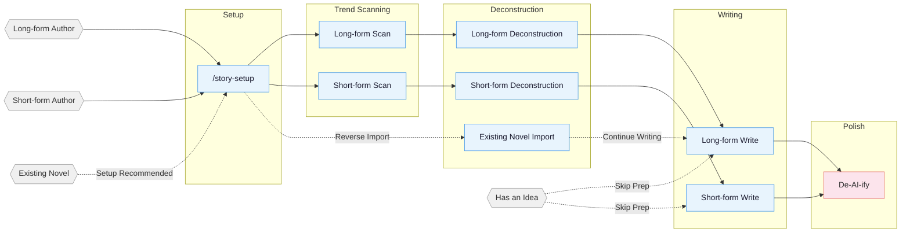

<!-- Last synced with README.md: 2026-09-16 -->

**English** | [中文](README.md)

# oh-story-claudecode

**A skill pack for writing Chinese web fiction: chart scanning, deconstruction, drafting, de-AI-ify and cover art, running inside the coding agent you already use.**

Project page: https://zenstory.ai/oh-story


## What it is

This is the [iceeyes27 unified-name fork](https://github.com/iceeyes27/oh-story-claudecode), using `story-write` / `story-analyze` / `story-scan` with mode selecting long or short form. Earlier split names remain in tag [`pre-unified-split-naming`](../../tree/pre-unified-split-naming).

oh-story-claudecode covers the full pipeline for long-form serials and short stories: scanning bestseller charts to choose genre, cast and angle; deconstructing top-ranked works into outline rhythm and reusable plot modules; drafting with hooks and payoff pacing; removing AI-flavored prose; and generating covers. It installs as 19 skills into Claude Code, ZCode, OpenClaw, Codex CLI and Reasonix, so the writing model is whatever model that agent runs; Web AI / agent environments that can read project files can use the generic skills path.

- **Checks and gates**: the skills ship with deterministic verifiers, an outline-before-prose gate, layered context and state management, 7 specialist agents, 8 automation hooks and 100+ methodology files.
- **The file system is the memory**: settings, outlines, prose and tracking live in separate files, so a novel hundreds of chapters long does not depend on conversation memory.
- **Target platforms**: Qidian, Fanqie, Jinjiang, Qimao and Zhihu Yanyan, for both long-form and short-form.

> **Tropes = deterministic emotional payoff**

Professional authors follow a three-step method:

1. **Scan** — analyze trending charts, identify genres, characters, and entry points.
2. **Deconstruct** — break down pacing and plot materials, build a personal module library.
3. **Commercialize** — learn and apply hooks, payoff density, expectation management.

Built around four pillars: reverse-engineering hits · plot modularization · layered state management · human-AI collaboration.

> Current fork version: **v0.8.1**, with `story-setup 1.2.11` / `agents_version: 30`. See [CHANGELOG.md](CHANGELOG.md); rerun `/story-setup` and start a new session after upgrading.

## Installation

```bash
npx skills add iceeyes27/oh-story-claudecode -y -g
```

`-g` installs globally (available in every directory); drop `-g` to install only into the current directory. Re-run the same command to update.

You can also tell Claude Code / ZCode / OpenClaw / Codex / Reasonix, or another Web AI / agent platform that can import a GitHub repo or skill:

```
Install this skill https://github.com/iceeyes27/oh-story-claudecode
```

To upgrade, repeat the same instruction.

Once installed, run `/story-setup` (`$story-setup` in Codex) from the root of your writing project to deploy hooks / agents / references, then start a new session.

<details>
<summary>Codex / ZCode / OpenClaw / Reasonix / Web AI usage notes</summary>

**Codex users:** Use it in-place: Codex scans `$REPO_ROOT/.agents/skills` (a symlink to `skills/`) and discovers all 31 repository Skills; invoke via `$story`, `$story-setup`, or `/skills`. On Windows, enable git `core.symlinks=true` or the symlink breaks — then use the `$story-setup` deployment below.

After `$story-setup` deploys into a writing project, it creates `.codex/agents/*.toml`, `.codex/hooks.json`, `.codex/hooks/{story_codex_hook.py,run-story-hook.sh,run-story-hook.cmd}`, and `.codex/skills/story-setup/references/agent-references/`. Trust the project `.codex/` layer, review/trust hooks in `/hooks`, and open a fresh Codex session so custom agents load.

**ZCode users:** Add this repository as a marketplace in Plugin Management and install `oh-story`; then invoke the 16 published Skills/Commands through `$story`, `$story-setup`, or the `/` panel. With `target_cli=zcode`, `$story-setup` deploys `.zcode/skills/`, `.zcode/commands/`, and `.zcode/hooks/story_zcode_hook.js`, then safely merges `.zcode/config.json` and the root `AGENTS.md`. Hooks require `node` on PATH. ZCode 3.3.4 does not execute project/plugin custom agents and has no `PreCompact` or `SessionEnd`; affected workflows report a solo/direct fallback, while `SessionStart` restores context after compaction.


**OpenClaw users:** Current support is skills-only. OpenClaw can discover the 16 published Skills from workspace `skills/`, `.agents/skills`, `~/.agents/skills`, `~/.openclaw/skills`, or configured extra skill roots. `SKILL.md` files use OpenClaw-compatible single-line `name` / `description` plus single-line JSON `metadata.openclaw`. When `story-setup` targets OpenClaw, it copies those published Skills into project `skills/` and writes an OpenClaw `AGENTS.md`; agents/hooks are intentionally deferred, so outline-before-prose guards are soft skill checks rather than runtime enforcement. If new skills do not appear immediately, open a fresh OpenClaw session or wait for the skills watcher to refresh.

**Reasonix users:** Current support is Skills + a native plugin manifest. Reasonix natively scans project skill roots (`.agents/skills` etc., a symlink to `skills/`) and discovers all 31 repository Skills — verify with `reasonix doctor capabilities`; you can also `reasonix plugin install` via the root `reasonix-plugin.json`. When `story-setup` targets `target_cli=reasonix`, it copies the 16 published Skills into project `skills/` and writes a Reasonix `AGENTS.md`; hooks/custom agents are intentionally deferred, so skills needing specialist agents fall back to solo/direct. If Windows symlinks are disabled, use the native plugin instead.

**Generic Web AI / agent users:** If your platform can read a GitHub repo or project files, have the agent read `skills/*/SKILL.md` plus the relevant `references/`. For local project copies, run `story-setup` with `target_cli=generic`; it only writes a generic `AGENTS.md` and `skills/`. Without this project's hooks/custom agents, checks run as skill-level soft constraints or solo/direct fallbacks.

**OpenClaw / Reasonix / generic paths need manual cleanup of nested directories:** these three keep their skill copy inside the project's `skills/`, so re-running `/story-setup` executes that project-local copy and the automatic cleanup never reaches them. If the project contains `skills/story-setup/references/agent-references/agent-references/` (possibly nested several levels deep) or `skills/story-setup/skills/`, delete them by hand. To update the skill text itself, reinstall this project and overwrite the public skill directories declared by `scripts/platform-skill-set.json` under the project's `skills/` from the new package.

</details>

After updating, if a project has already run `/story-setup`, re-run `/story-setup` from the project root to sync hooks / agents / references. Per-version changes are in [CHANGELOG.md](CHANGELOG.md) and [Releases](https://github.com/iceeyes27/oh-story-claudecode/releases).

**Multi-agent collaboration needs setup + a fresh session:** the 7 specialist agents (story-architect, narrative-writer, consistency-checker, etc.) are written into your project's `.claude/agents/` by `/story-setup`, or into `.codex/agents/*.toml` by `$story-setup`. Claude Code and Codex register custom agents most reliably at session start; ZCode 3.3.4, OpenClaw Phase 1, Reasonix Phase 1, and the generic path default to skills + solo fallback. To check Claude/Codex agents: run `/story-review` in the new session — `Effective Mode: full/lean` means agents registered, `Fallback: ... -> solo` means they are unavailable.

**Import and continuation order:** run `/story-setup` from the writing-project root first to deploy hooks, agents, and `AGENTS.md`; start or refresh the session, then run `/story-import` for the existing novel and continue with `/story-write 日更` or `/story-write 写第N章`. You can also run `/story-import` directly; if setup is missing, it offers to run setup first or continue with a serial import.

**Author preferences persist across sessions:** tell `/story` to remember a writing habit; the write counts as successful only when it returns an `Author Memory Receipt`. Normal writing queries only relevant confirmed items with a hard 2 KB output cap, rather than injecting the full profile, candidates, and history into the prose prompt. This memory stays separate from per-book continuity tracking, and current instructions, book settings, and hard gates always take priority.

## Your First Request

Copy one, tweak it and send it: pick the brief that fits your task and replace the 〈placeholders〉.

1. **Start a new book**
   > I want to start a new 〈genre/premise〉 book. First separate fixed facts in my material from decisions that remain open. Plan only a bounded opening and deliver the central conflict, viewpoint/information-release limits, changes across the first three chapters and open decisions. Do not draft prose automatically; leave genre tradeoffs, character motives and the long-term direction for me to confirm.
2. **Import an existing manuscript**
   > Organize this manuscript as a continuable project. Chapters 1–〈N〉 are complete; 〈filename〉 is a partial chapter 〈N+1〉. Preserve the source prose, do not overwrite complete chapters, and do not count the fragment as a complete chapter, and separate inferred settings for confirmation. First deliver the detected range, reconstructed facts, conflicts/ambiguities and decisions requiring my confirmation for review; do not continue the story yet.
3. **Fix an unsatisfactory passage**
   > This passage reads as 〈vague/repetitive/over-explained〉. First name the specific reading problem while preserving story facts, character knowledge and unrevealed information. Deliver only a proposed revision of this passage, a before/after comparison and reasons—not a book-wide rewrite. I will decide which suggestions to accept.

## Pipeline Overview



## Skills

| Skill | Trigger | Description |
|:------|:--------|:------------|
| `story-setup` | `/story-setup` / `$story-setup` | Environment setup — Claude/Codex/ZCode/OpenClaw/Reasonix plus generic (safe merge) |
| `story` | `/story` / `$story` / `/story dashboard` | Toolbox router, author-preference management, and local deconstruction/project dashboard |
| `story-write` | `/story-write` | Long-form writing — outline building, character design, prose output |
| `story-analyze` | `/story-analyze` | Long-form deconstruction — Golden First 3 Chapters, payoff design, pacing analysis |
| `story-scan` | `/story-scan` | Long-form trend scan — Qidian/Fanqie/Jinjiang market trends |
| `story-write` | `/story-write` | Short-form writing — emotion design, twist crafting, polish & delivery |
| `story-analyze` | `/story-analyze` | Short-form deconstruction — story core, structure, emotional arc, reversal design, writing techniques, resonance analysis |
| `story-scan` | `/story-scan` | Short-form trend scan — Zhihu Yanayan/Fanqie short-form trending data |
| `story-deslop` | `/story-deslop` | De-AI-ify — detect and remove AI writing traces |
| `ai-flavor-scan` | `/ai-flavor-scan` | Seven-layer AI-flavor scan — separate remove, expand, and retain findings |
| `dialogue-naturalness-scan` | `/dialogue-naturalness-scan` | Dialogue naturalness — detect vague references, formal register, and awkward phrasing |
| `jargon-verb-scan` | `/jargon-verb-scan` | Readability scan — detect industry nouns forced into verb roles |
| `humanizer` | `/humanizer` | Remove AI writing traces from Chinese or English text |
| `story-import` | `/story-import` | Reverse import — parse existing novels into standard project structure |
| `story-review` | `/story-review` | Multi-perspective review — 4-agent adversarial review + Fanqie/Qidian/Zhihu scoring rubrics |
| `story-cover` | `/story-cover` | Cover generation — title/genre analysis + GPT-Image-2 via Codex included usage or API fallback |
| `browser-cdp` | `/browser-cdp` | Browser control — CDP protocol for scraping with reusable login sessions |

> `story-deslop` uses local prose linting: blocking applies only to deterministic style/punctuation issues, while other findings require read-through judgment; external detectors such as Zhuque are self-check references, not replacements for human review.

Natural language also triggers: `帮我开书` ("help me start writing") → `story-write`, `这篇太AI了` ("this is too AI-ish") → `story-deslop`, `把我的书导进来` ("import my book") → `story-import`, `打开工作台` ("open the dashboard") → `story dashboard`, `记住我的写作习惯` ("remember my writing habits") → `story` author memory, `沈栀现在什么状态` ("what's Shen Zhi's current status") → `story-explorer`.

### Story Dashboard

Run `/story dashboard` (`$story dashboard` in Codex) to open the local writing desk. Browse
deconstruction libraries and long/short project trees, then search, preview Markdown, edit text,
save with conflict protection, or confirm a file deletion. It listens only on `127.0.0.1` and never
uploads story content.

<details>
<summary>Cover generation example</summary>


</details>

<details>
<summary>Deconstruction demo — Coiling Dragon</summary>

Full output from `/story-analyze` deep mode on the first 23 chapters of *Coiling Dragon*:

```
demo/拆文库/盘龙/
├── 概要.md              # Novel overview + chapter index
├── 拆文报告.md           # 5-dimension scoring + pacing analysis + takeaways
├── 文风.md              # Benchmark voice: sentence rhythm, punctuation, dialogue subtext, emotion pacing
├── 章节/
│   ├── 第1章_深度拆解.md … 第3章_深度拆解.md  # One deep analysis per Golden-3 chapter
│   └── 第1章_摘要.md … 第23章_摘要.md          # One summary file per chapter
├── 角色/
│   ├── 林雷.md           # Protagonist full profile
│   ├── 霍格.md           # Core supporting
│   ├── 希尔曼.md         # Core supporting
│   ├── 希里.md           # Functional character
│   ├── 德林柯沃特.md      # Core supporting
│   ├── 沃顿.md           # Functional character
│   └── 角色关系.md        # Relationship network
├── 剧情/
│   ├── 故事线.md          # Framework + 4 plotlines + 2 storylines
│   ├── 强者过境与魔法启蒙.md etc.  # Five scene-level plot units
│   ├── 节奏.md            # Pacing + key-info progression + emotional trigger eruption rhythm
│   └── 情绪模块.md        # Reader needs + emotional engine + reusable writing modules
└── 设定/
    ├── 世界观/
    │   ├── 背景设定.md    # Core rules + special settings
    │   ├── 力量体系.md    # Battle qi + magic + ranks
    │   ├── 地理.md        # Andaluxia + Yulan Continent
    │   └── 金手指.md      # Panlong Ring + Delin Cowort
    └── 势力/
        └── 巴鲁克家族.md  # Baluk family (dragon-blood lineage)
```

Long-form deconstruction also produces `文风.md`, plus `剧情/节奏.md` (pacing, key-info progression, emotional trigger eruption rhythm) and `剧情/情绪模块.md` (reader needs, emotional engine, reusable writing modules); daily writing consumes these through `对标/{书名}/剧情/` to keep voice, pacing, and emotion modules close to the benchmark.

</details>

<details>
<summary>Deconstruction demo — Once I Hid My Love (曾将爱意私藏, short-form)</summary>

`/story-analyze` deconstructing the short story 《曾将爱意私藏》 (~8,500 chars, win-back / "faked-death" genre):

```
demo/拆文库/曾将爱意私藏/
├── 原文/原文.txt        # Source backup
├── 拆文报告.md          # Story core + 5-dim scores + 6-facet payoff + cognitive reversal + 9-layer resonance
├── 情节节点.md          # 54 plot points (source quotes + emotion markers −9~+9)
├── 写作手法.md          # POV / dialogue / info-gap / object-hook — 11 techniques
└── _meta.json           # structure_counts (Phase 7 gate basis)
```

Short-form deconstruction outputs `拆文报告 / 情节节点 / 写作手法`; downstream `/story-write` writes a new same-genre story from them.

</details>

<details>
<summary>Import demo — 让你管账号，你高燃混剪炸全网 (long-form continuation project)</summary>

Run `/story-setup` first, then use `/story-import` to reverse-build the author's already-published first 20 chapters (~37k Chinese chars) into a continuation-ready writing project. Continue with `/story-write 日更` or `/story-write 写第21章`:

```
demo/长篇/让你管账号，你高燃混剪炸全网/
├── 正文/        Chapters 001–020 (published source text)
├── 大纲/        大纲.md · 卷纲_第1卷.md · 细纲_第001–020章.md (one file per chapter)
├── 设定/        角色/ (6 character files) · 世界观/{background · cheat-system}
│                关系.md · 题材定位.md · 文风.md
└── 追踪/        伏笔.md (foreshadowing) · 时间线.md (timeline) · 角色状态.md (state) · 上下文.md
```

Per-chapter extraction (events / characters / settings / foreshadowing / timeline) is reverse-engineered into a continuation bible, so the author seamlessly continues from chapter 21.

</details>

## Agent System

Writing skills internally coordinate 7 specialized agents:

| Agent | Model | Role |
|:------|:------|:-----|
| **story-architect** | Opus | Story architecture — genre positioning, outline structure, hook/twist design, emotion arcs |
| **character-designer** | Sonnet | Character design — profiles, voice, motivation chains, dialogue writing |
| **narrative-writer** | Sonnet | Narrative writer — prose writing, de-AI-ify, format compliance |
| **consistency-checker** | Haiku | Consistency check — fact conflict scanning, foreshadowing tracking, S1-S4 grading reports |
| **story-researcher** | Sonnet | Research — CDP search + full-text extraction, multi-source cross-verification, structured reference files |
| **story-explorer** | Haiku | Story query — read-only character/foreshadowing/setting/progress lookup, quick context loading |
| **chapter-extractor** | Haiku | Chapter extraction — summaries, plot points, character mentions, parallel deconstruction unit |

Agents load writing theory from `references/` on demand (character design, dialogue techniques, twist toolbox, etc. — 100+ methodology files), without reserving context window space.

## Automation Hooks

`/story-setup` deploys 8 automation hooks for Claude Code:

| Hook | Trigger | Function |
|:-----|:---------|:---------|
| session-start.sh | Session start | Display branch, progress snapshot, deconstruction status |
| session-end.sh | Session end | Log session to `追踪/session-log.txt` |
| detect-story-gaps.sh | Session start | Detect setting gaps, missing outlines, foreshadowing breaks |
| pre-compact.sh | Before context compaction | Save progress snapshot path and line-count summary |
| post-compact.sh | After context compaction | Prompt to read progress snapshot for context recovery |
| validate-story-commit.sh | git commit | Check hardcoded attributes, setting required fields (warning only, non-blocking) |
| guard-outline-before-prose.sh | Before writing prose (Write/Edit) | Blocks first creation of a chapter/story body when its 细纲/小节大纲 is missing (blocking) — enforces outline-first |
| check-prose-after-write.sh | After writing prose (Write/Edit) | Lightly scan for truncation, leaked workflow terms, deterministic toxic phrasing, and word-count debt (advisory) |

## Project File Structure

A long-form novel can easily reach hundreds of thousands of words across hundreds of chapters. Setting conflicts, broken foreshadowing, timeline inconsistencies — relying on memory alone is a recipe for disaster.

The file system separates settings, outlines, prose, and tracking into independent dimensions. The conversation handles creation; the file system handles memory.

Workspace-level author memory stays separate from any one book:

```text
.story/作者记忆/
├── _author-memory-state.json  # Single structured authority
├── 作者画像.md               # Confirmed preferences used in creation
├── 待确认.md                 # Inferences, repeated corrections, conflict candidates
└── 变更记录.md               # Auditable replacement and withdrawal history
```

**Long-form:**

```
{Book Title}/
├── Settings/
│   ├── World/              # Background, power systems, etc. — one file per topic
│   ├── Characters/         # One file per character (Shen_Zhi.md, Lu_Yanzhi.md)
│   ├── Factions/           # One file per faction/organization (Tianji_Pavilion.md)
│   ├── Relationships.md    # Character relationship map
│   └── Genre_Positioning.md # Core trope + benchmark analysis
├── Outline/
│   ├── Outline.md          # Full-book volume-level structure
│   ├── Volume_1.md         # One per volume: payoff pacing + emotion arc + character arc + foreshadowing + twists
│   ├── Chapter_001.md      # One per chapter: summary + multi-line plot + relationships/order + hooks
│   └── ...
├── Prose/
│   ├── Chapter_001_Title.md
│   └── ...
├── Benchmark/                # Benchmark reference (structured subdirs synced from deconstruction)
│   └── {Benchmark Book}/
│       ├── Source/              # Benchmark book original chapters
│       ├── Characters/         # Structured character profiles (synced from analyze)
│       ├── Plotlines/          # Structured plot lines/pacing/emotion modules (synced from analyze)
│       ├── Settings/           # Structured world settings (synced from analyze)
│       ├── 文风.md              # Benchmark voice used before daily writing
│       └── Report.md            # Analyze skill output
├── Tracking/                # Continuity management (layered tracking)
│   ├── Context.md           # Writing context (for compact recovery)
│   ├── Foreshadowing.md     # Foreshadowing planted/resolved status table (cross-volume)
│   ├── Timeline.md          # In-story timeline (full-book)
│   └── Character_Status.md  # Character current state snapshots (per-chapter)
├── References/              # story-researcher output
│   └── {topic}.md           # Split by research topic
```

**Short-form file structure:**

```
短篇/{Title}/
├── 正文.md                  # Final draft
├── 小节大纲.md              # 8-section structure + emotion curve
└── 拆文库/                  # If a reference novel exists (analyze output)
    └── {Book}/
        ├── 拆文报告.md
        ├── 情节节点.md
        └── 写作手法.md
```

**Deconstruction Library:** Deconstruction skills save structured outputs (characters, plotlines, settings, chapters) under `拆文库/{Book Title}/` at project root; long-form plot output includes `节奏.md` and `情绪模块.md`. Writing skills consume these assets through `对标/{书名}/剧情/` and related benchmark subdirectories, or automatically fall back to reading from the deconstruction library.

**`.active-book`:** a text file at project root containing the active book's relative path (for example, `长篇/My Novel`). Hooks and writing skills use it to locate the current project.

## Knowledge Base

Each skill includes a `references/` knowledge base loaded on demand to keep context lean.

<details>
<summary>Expand the per-skill knowledge-base topic list</summary>

| Topic | Contents | Skill |
|:------|:---------|:------|
| Outline Layout | Five-step outline method · Story structure levels · Node design · Progression design | long-write |
| Opening Design | Opening patterns · First 500 words · Golden First 3 Chapters | long-write / short-write |
| Character Design | Character profiles · Character extraction · Relationship mapping · Motivation chains · Ensemble casts | long-write / short-write / short-analyze |
| Hook Techniques | 13 chapter-end hooks · 7 chapter-start hooks · Paragraph-level hooks · Suspense orchestration | long-write / short-write / short-analyze |
| Emotion Design | 6 arc templates · Expectation management · Genre track strategies | long-write / short-write |
| Genre Frameworks | Long-form 8-node · Short-form compressed 3-act · 8 genre opening templates | long-write / short-write / short-analyze |
| Dialogue Techniques | Rhythm · Subtext · Information control · Dialogue pattern database | long-write / short-write |
| Twist Toolbox | Types · Timing · Misdirection base paths | long-write / short-write |
| Style Modules | Dialogue · Combat · Mind games · Cinematic writing · Face-slapping · Plain description | long-write |
| Advanced Techniques | 4-step micro-outline · Climax reverse-engineering · Dual-thread structure · AB interweaving | long-write |
| De-AI-ify | Prevention · 3-pass de-AI method · Rewrite examples · Banned word list | deslop / long-write / short-write |
| Quality Checks | General · Long-form specific · Short-form specific · Toxic trope detection | long-write / short-write / short-analyze |
| Writing Formulas | 21 genre formulas · Three-flip-four-shock (escalating reversal) · Romance four-stage | short-write / short-analyze |
| Female-oriented Writing | Female reader preferences · Emotional description · Romance patterns · Benchmark analysis | short-write |
| Deconstruction Methods | Golden First 3 Chapters · Emotion curves · Structure breakdown · Zhihu style analysis | long-analyze / short-analyze |
| Short-form Methodology | Story core · Plot nodes · Explosive point analysis · Writing techniques · Rhythm analysis · Resonance analysis · Character classification · Platform fit | short-analyze |
| Deconstruction Examples | Full case breakdowns · Template output | short-analyze |
| Reader Profiles | 9-dimension profiles · Target reader analysis | long-scan |
| Market Data | Genre trends · Platform characteristics · Collection formats · Submission guides | long-scan / short-scan |
| Cover Styles | 10 genre visual styles · Color composition · Prompt templates | story-cover |
| Adversarial Review | Multi-perspective review · Scoring rubrics · Toxic trope detection | story-review |

</details>

## Supported Platforms

**Long-form** Qidian (起点中文网) · Fanqie Novels (番茄小说) · Jinjiang (晋江文学城) · Qimao (七猫小说) · Ciweimao (刺猬猫)

**Short-form** Zhihu Yanyan (知乎盐言故事) · Fanqie Short-form (番茄短篇) · Qimao Short-form (七猫短篇)

Real output samples are in [demo/](demo/): short-form deconstruction 《曾将爱意私藏》 · long-form deconstruction 《盘龙》 · long-form continuation project 《让你管账号，你高燃混剪炸全网》 · cover sample 《剑道独尊》.

I built this skill pack to help me through a job-hunting transition :joy:, and I hope it can help others too.

## FAQ

### Does it work in Codex, or only in Claude Code?

oh-story-claudecode ships adapters for Claude Code, ZCode, OpenClaw, Codex CLI and Reasonix. Codex discovers the 19 skills by scanning `.agents/skills` in the repo and invokes them with `$story-setup`. Any Web AI or agent environment that can read project files can use the generic skills path.

### Do I need a GPU or to host a model?

No. oh-story-claudecode is a set of skills that runs inside the coding agent you already use, so the writing model is that agent's model; only deterministic check scripts (Node / Python) run locally. The one exception is `story-cover`, which calls GPT-Image-2 (Codex built-in quota or an API fallback).

### Chapter lengths are inconsistent or the word count is off. What do I do?

Since v0.7.7 long-form prose uses a single machine-counted length metric: every chapter blueprint must state a valid word target, and a missing target stops the run instead of falling back to 3,000; under-length chapters are not padded with new plot, and over-length chapters get at most one compression pass. `check-prose-after-write.sh` flags length debt after each write. Rerun `/story-setup` and start a new session after upgrading an older project.

### After de-AI editing, detectors such as Zhuque still flag the text as AI. Why?

`story-deslop` (`/去AI味`) is a writing lint: it deterministically detects and removes known AI sentence patterns, punctuation habits and degeneration artifacts. Its target is how the prose reads, not evading detectors. External detectors are a self-check reference only.
[This concrete revision guide](https://zenstory.ai/oh-story/revise-ai-prose) separates vague emotion, repeated syntax, unearned commentary and over-explaining while preserving the scene's job and the author's facts; this repository's own mechanism is described in [去AI味的具体做法](docs/how-to-remove-ai-flavor-from-web-fiction.md) (Chinese).

### I already have part of a novel written. Can I import it and continue?

Yes. Run `/story-setup` in the project root, start or refresh a session, run `/story-import` to reverse-parse the existing novel into the standard project layout, review its inferences, then continue with `/story-write long 日更` or `/story-write long 写第N章`. The [import-and-continue guide](https://zenstory.ai/oh-story/import-and-continue) explains why manuscript evidence should take priority over model guesses.

### How do I reduce forgotten clues or characters knowing answers too early in a long continuation?

Before continuing, separate objective story facts, character knowledge and what readers have seen; carry only the relevant current state and unfinished commitments into the chapter. The [long-novel continuity guide](https://zenstory.ai/oh-story/long-novel-continuity) gives a three-chapter example; [Keep an AI-written novel consistent over 100+ chapters](docs/keep-ai-novel-consistent-over-100-chapters.md) describes how this repository tracks continuity.

### My chapter outline is complete. Why does the prose still summarize the setup?

Treat the outline as a specification for what must change, then turn its goal, obstacle, evidence, choice and cost into actions and results the viewpoint character can perceive. The [outline-to-chapter guide](https://zenstory.ai/oh-story/outline-to-chapter) walks through an editorial example.

### How do I keep my voice without carrying plot facts over from another book?

Describe the dimensions of a short sample you wrote or may use, separately from the current book's facts; sample inference does not automatically establish an enduring preference. The [author-voice guide](https://zenstory.ai/oh-story/preserve-author-voice) explains how to resolve the current request, book style and author preferences; use samples as a reference for expression and never copy sentences.

### On Windows the install prints `ENOENT ... mkdir` but ends with Done. Is that normal?

It means some skills were not fully installed. Rerun the same install command, with or without the error, and it repairs itself; if a reference-material directory is missing, `/story-setup` reports the reference pack as incomplete. Codex users on Windows also need `core.symlinks` enabled in git.

### What do I do after upgrading?

Rerun `/story-setup` and start a new session. The seven agents (story-architect, narrative-writer, consistency-checker and others) are written into the project by `/story-setup`; multi-agent collaboration only takes effect after deploying and opening a fresh session.

### What is the difference between the short-form and long-form entry points?

Long-form: `/story-scan long` (chart scanning) → `/story-analyze long` (deconstruction) → `/story-write long` (outline, volume outline, chapter blueprints, prose). Short-form: `/story-scan short` → `/story-analyze short` → `/story-write short`. Both share `/story-setup`, `/story-deslop`, `/story-review` and `/story-cover`.

## Further reading

- [Prompts, skill packs, plugins and MCP](https://zenstory.ai/oh-story/agent-skills-for-writers) — choose the writing job before the host and workflow
- [Import 10–20 chapters and continue](https://zenstory.ai/oh-story/import-and-continue) — review inferred structure; treat the manuscript as evidence
- [Separate character knowledge, promises and clues](https://zenstory.ai/oh-story/long-novel-continuity) — do not turn future plans into past events
- [Write plot specifications as visible change](https://zenstory.ai/oh-story/outline-to-chapter) — advance through action, choice, cost and result
- [Reduce "AI-sounding" prose with concrete edits](https://zenstory.ai/oh-story/revise-ai-prose) — improve the reading experience, not a detector score
- [Separate voice choices from book facts](https://zenstory.ai/oh-story/preserve-author-voice) — use authorized samples without copying phrases
- [Keep an AI-written novel consistent over 100+ chapters](docs/keep-ai-novel-consistent-over-100-chapters.md) — in-repo doc
- [Claude Code skills that are not for coding: a fiction-writing pack as the worked example](docs/claude-code-skills-for-writers.md) — in-repo doc
- [去AI味的具体做法](docs/how-to-remove-ai-flavor-from-web-fiction.md) — in-repo doc (Chinese)
- [扫榜和拆文的自动化做法](docs/scan-charts-and-deconstruct-bestsellers.md) — in-repo doc (Chinese)

## Star History

<a href="https://www.star-history.com/?repos=iceeyes27%2Foh-story-claudecode&type=date&legend=top-left">
 <picture>
   <source media="(prefers-color-scheme: dark)" srcset="https://api.star-history.com/chart?repos=iceeyes27/oh-story-claudecode&type=date&theme=dark&legend=top-left" />
   <source media="(prefers-color-scheme: light)" srcset="https://api.star-history.com/chart?repos=iceeyes27/oh-story-claudecode&type=date&legend=top-left" />
   
 </picture>
</a>

## Contributing

Contributions are welcome — new skills, knowledge base additions, market data updates. See [CONTRIBUTING.md](CONTRIBUTING.md) (Chinese only).

## Community

- **Telegram**: <https://t.me/ohstoryclaudecode> — chat, troubleshooting, and feature discussion.
- **GitHub Discussions**: [ask questions, get help, share workflows](https://github.com/iceeyes27/oh-story-claudecode/discussions).

## Acknowledgments

- [LINUX DO - The New Ideal Community](https://linux.do) — Community support
- [FanqieRankTracker](https://github.com/wen1701/FanqieRankTracker) — Fanqie Novels font obfuscation decoding reference
- [Zhuque AIGC Detector CLI](https://github.com/Sophomoresty/zhuque) — External retest reference used during anti-AI-writing experiments

## Part of ZenStory AI

Oh Story is part of [ZenStory AI](https://zenstory.ai) — open-source, agent-native tools for creating, adapting and producing stories (GitHub org: [zenstory-ai](https://github.com/zenstory-ai)). Sibling projects:

| Project | What it does |
| --- | --- |
| [oh-story-claudecode](https://github.com/zenstory-ai/oh-story-claudecode) | Web-fiction writing skill pack (this repo) |
| [drama-skills](https://github.com/zenstory-ai/drama-skills) | AI short-drama / motion-comic suite: scripts, assets, storyboards, image & video prompts, independent review |
| [novel-to-game](https://github.com/zenstory-ai/novel-to-game) | Agent skills for source-grounded novel adaptation, target-runtime builds, and evidence-based QA |
| [video-recap-skills](https://github.com/zenstory-ai/video-recap-skills) | Create Chinese-narration recaps from supported video files, with optional editable JianYing/CapCut draft export |
| [oh-story-dsh](https://github.com/zenstory-ai/oh-story-dsh) | Community DeepSeek Harness plugin with novel, short-drama, game and video-recap workbenches |
| [zenstory](https://github.com/zenstory-ai/zenstory) | Chat-to-create AI novel-writing workbench ([app.zenstory.ai](https://app.zenstory.ai)) |

The upstream repository moved from worldwonderer/oh-story-claudecode to zenstory-ai; old links redirect.
