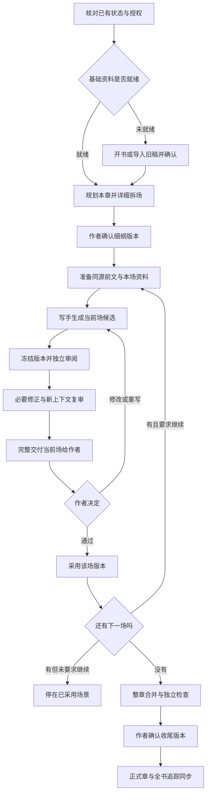

# novel-kit 当前工作逻辑与使用指引

核对日期：2026-10-04。本文依据当前共享规则、技能和实现整理，用于理解现状并讨论调整；本文本身不新增流程、不登记小说状态。现行规则与“可讨论的调整”分别标明。文末保留已发现的不一致和未验证范围。

你可以先读第 1、2、5、7 节了解主流程，再用第 12 节的编号指出想保留或修改的环节。日常用自然语言提出要求即可，文件、状态和命令由协调器维护。

## 1. 当前逻辑的一页总览

**先确认规划，再逐场写作或优化；每场独立审阅，交作者采用；全场通过后，另做整章收尾和正式采用。**

这里有四种不同的工作单位：

| 单位 | 当前如何处理 | 完成后意味着什么 |
| --- | --- | --- |
| 规划 | 按章规划，详细拆成场景 | 作者确认的是将要发生的事件，不是未来正文 |
| 写作或优化 | 每次只推进一个场景 | 形成当前场候选，尚未成为正式章节 |
| 作者逐场审核 | 看本场全文、改动、证据和变化 | 只确认指定场景的指定版本 |
| 整章收尾 | 合并、顺稿、整章盲读、事实与兑现检查 | 作者另行采用后，才更新正式章节与全书追踪 |

有采用中断、未完成修订或待复核依赖时，先恢复已有工作，不从图中间跳入下一场。“通过”通常采用后停止；末场通过后准备整章收尾交付。整章仍需另行采用。

## 2. 三层责任：谁做决定，谁做工作，谁检查

| 层次 | 负责的事情 | 能保证到哪里 |
| --- | --- | --- |
| 作者 | 题材、情节、重要设定、修改范围、审美取舍、版本采用 | 最终创作决定；模型不能代行 |
| 主会话协调器 | 恢复状态、选流程、选择必要原文、安排角色、汇总分歧、展示交付、执行采用 | 依规则组织工作；选材完整性和问题判断仍需推理 |
| 本地工具 | 检查顺序、确认版本、记录状态、冻结输入、采用与恢复、文件保护 | 核对路径、版本和记录；不理解故事，也不能证明真人授权 |

主会话有独立子代理可用时，将正文交给明确指定的写手。角色各司其职：

| 角色 | 主要工作 | 不代表什么 |
| --- | --- | --- |
| scene-writer 写手 | 写当前场、按授权修正、重写、顺稿 | 自修不算独立审阅，不自行采用 |
| copy-editor 文字编辑 | 检查顺读理解、语法、指代、段落承接 | 不替作者解释原意，不用细纲补足正文 |
| consistency-checker 一致性检查 | 核对事实、时间、资源、道具、知情和修订依赖 | 不裁定正文与设定冲突，也不替作者补事实 |
| character-reviewer 角色审阅 | 对话、声线、动机、关系变化 | 不把个人喜好当人物必须遵守的规则 |
| prose-reviewer 自然度审阅 | 判断重复、解释、比喻、节奏是否造成阅读损失 | 不按关键词或出现次数自动判错 |
| structure-reviewer 结构审阅 | 对照细纲、场景功能、出口状态和兑现 | 不能以提到某个词就认定兑现完成 |
| chapter-extractor 旧稿抽取 | 导入时逐章提取事件和事实，附原文 | 抽取不等于全书体检或作者确认 |

小说采用关卡用于创作工作；维护程序、整理本指引和运行隔离测试，不按小说采用处理。

## 3. 从你的要求进入哪条流程

| 你要做什么 | 入口 | 当前流程和停点 |
| --- | --- | --- |
| 从零开书 | new-book | 读已有材料，补必要信息，建立设定、角色、大纲、兑现和文风样本，做结构预检，交作者确认待定事项 |
| 接手已有书稿 | import-book | 备份原稿、按章整理、抽取和重建资料，列冲突与推断，作者确认后登记导入版本 |
| 规划下一章 | plan-chapter | 检查前章是否收尾，处理到期承诺与兑现，详细拆场，事实预检，交作者确认细纲 |
| 写新场或修改待审稿 | write-scene | 生成或重开当前候选，独立审阅和必要修正，详细交付当前场 |
| 修改已经采用的内容 | revise | 建立修订任务，按场优化、审核，最终采用完整目标并同步追踪 |
| 集中检查对白、动作、资源和衔接 | fiction-scene-polishing | 先定保留项和问题证据，按授权精修；已采用正文仍接 revise 的版本与采用流程 |

开书的文风样本来自作者提供或指定的文字，导入时从原稿选择；没有样本先标待补，不让 AI 自己写一份当审美标准。

导入默认保持原文，原稿备份不可改删；“全书体检”是作者另外选择的工作。只抽取近期章节或早期摘要时，必须说明覆盖，不能宣称全书已详细审查。导入复制是正式正文写入的特定整理步骤，不等于后续小说采用，也不能仅凭文件存在就续写。

## 4. 规划一章时，究竟规划什么

协调器先列本章应处理的到期伏笔、兑现、常驻表现和上一章承诺。每项要么排入本章，要么由作者决定延期或退役，并留下理由；不能在换章时自然消失。

一场细纲至少要说清：**谁在什么处境下想做什么，遇到什么阻碍，具体发生哪些事，结束后什么发生变化。**

具体记录包括视角、时间地点、在场者、入场状态、目标、阻碍、情节点、必要前因原文、资源和道具起止、知情变化、结尾状态、字数目标及兑现要求。按实际事件拆场，不规定每章固定几场。

兑现按四类管理：

| 类别 | 含义 | 当前处理 |
| --- | --- | --- |
| 兑现 | 读者应看到的能力、场面或承诺结果 | 规划位置；正文实际呈现后附证据，正式状态随采用更新 |
| 约束 | 能力边界、资源规则等 | 适用时遵守，不必每次解释给读者 |
| 常驻 | 持续出现的人物特质、关系或氛围 | 用窗口提醒，不为凑次数硬塞表现 |
| 储备 | 暂不进入正文的点子 | 保留为想法，不当成已发生事实 |

一致性检查员做预检后，按场把详细安排交作者确认。确认细纲只批准规划版本。当前下一章规划流程仍与上一章收尾相连；全书和分卷方向可以提前准备，任意多章细纲并行确认不是现成功能。

这里要区分“讨论或编辑细纲”和“登记为可写的细纲”：工具限制的是细纲确认、重绑及场景写作，不是禁止普通细纲文件的一切编辑。提前构思不等于已获得跳章写作资格。

## 5. 每写一场，按什么顺序工作

| 步骤 | 谁负责 | 做什么和产物 |
| --- | --- | --- |
| 1. 恢复与检查 | 协调器＋工具 | 核对细纲确认版本、前场采用、修订阻塞、待审交付；只选择当前合法场景 |
| 2. 准备资料 | 协调器＋供给工具 | 选直接前场和必要前因，生成同源资料与版本清单；明确缺项 |
| 3. 写作与自修 | 写手 | 只写指定场景，到细纲要求的出口状态停止；逐句、逐段、对照文风自修 |
| 4. 确定性预检与开读冻结 | 工具 | prose-check 只读检查复读、截断、占位语和流程术语混入，blocking 先交写手重写所在段落；随后保存候选及实际输入版本，不能审完才补冻结记录 |
| 5. 独立审阅 | 指定审阅者 | 首轮各自读分配资料，互不接收其他审阅意见，提交原句、问题、保留项 |
| 6. 汇总与必要修正 | 协调器＋写手 | 合并同一问题；只把满足自动修正条件的条目交写手；保留全部分歧 |
| 7. 修后复审 | 新文字编辑＋原提问角色 | 文字编辑重新盲读完整当前场；原提问角色核对问题是否解决及是否引入新问题 |
| 8. 准备交付 | 工具＋协调器 | 核对开读版本和交付全文一致，展示完整当前场及详细审核材料 |
| 9. 作者决定 | 作者 | 采用、修改、重写或暂缓；决定只作用于明确版本 |

字数通常按细纲目标控制在约 ±15%，不为凑字数灌水。可以用动作、对白、心理和留白表现情绪，跟随作者文风。必要事实缺失或细纲写不通时，先报告，不能由写手硬编关键设定。

## 6. 给每个角色哪些资料

前文供给分成三部分：

1. **直接前场原文**：按读者看到的叙事顺序，不按故事时间倒排。同章未收尾时用已经采用的前场版本。
2. **必要更早前因原文**：涉及动机、能力限制、物件来历、旧承诺等，由协调器根据当前场选择。摘要和事实表不能替代这些原文。
3. **累计事实**：最新有效的时间、位置、资源、道具、知情及出口状态，给写手和事实检查使用。修订后替换失效内容，不把新旧两套状态相加。

当前工具收集同章各已采用场景交付中的有效事实段，依次放入写手资料；它不会自动合并成最终世界状态，也不会替作者计算资源余额。协调器仍要辨认哪些记录已被后续事件改变。

写手和文字编辑收到**同范围的冻结前文原文**。当前供给工具跨章实际采用最新正式上一章全文，不会自动识别尾场后缩短。通用协议允许在边界可靠时取前章末尾完整场景；工具现在采用的是更保守的全文范围。

| 接收者 | 额外给什么 | 需要隔离什么 |
| --- | --- | --- |
| 写手 | 细纲、设定、角色、文风、语文规格、相关兑现、追踪与最新累计事实 | 不能将作者真相当成角色或读者已经知道的事实 |
| 文字编辑 | 完整纯正文候选、语文规格、文风样本；修订可另给指定相邻已采用正文 | 细纲、设定、追踪、事实解释、出口状态、作者意图、修改要求、对照、任务及其他审阅意见 |
| 一致性检查 | 候选、前文、设定角色、追踪、兑现、累计事实与出口状态 | 未确认推断不能充作事实；允许搜索后续已采用正文核查依赖 |
| 角色审阅 | 候选、前文、出场角色卡 | 首轮其他审阅意见 |
| 自然度审阅 | 候选、文风样本及语文保护边界 | 首轮其他审阅意见；不引入跨作品通用禁词表 |
| 结构审阅 | 候选、细纲及相关兑现；修订另给作者要求 | 首轮其他审阅意见 |

“独立盲读”指文字编辑在独立上下文中，不看作者解释和改稿意图，读指定原文；不是声称它读过全书。无并行能力可以顺序使用独立上下文；同一会话切换角色自审不能算独立盲读。

文字编辑不能接收写手资料包、含选材理由或事实解释的清单，以及上一轮问题；也不能自行扩读未指定材料。修订时提供的后续相邻正文只用于检查接口，不能倒过来解释读者在当前场尚未得知的信息。

前文不足时，先列需要补读的原文。补入后更新冻结范围，重新独立盲读；不把设定说明塞给文字编辑，要求它接受作者原意。工具核对来源、范围和版本，**必要前因是否选全仍是协调器的判断**。

供给工具产出的是前文原文、事实资料及来源清单，不是所有角色的完整任务包。当前候选、文风、语文规格及各角色所需的其他资料，仍须由协调器分配并一并登记实际开读版本。

## 7. 怎么审，什么问题会自动改

### 审阅组合

| 模式 | 当前用途 | 首轮角色 |
| --- | --- | --- |
| 完整 | 新场景、重写、情节修订 | 文字、事实、角色、自然度、结构，共五位 |
| 文字 | 已采用正文的纯文字修订 | 文字、事实，共两位 |
| 章节 | 章节收尾、整章修订最终检查 | 文字整章盲读、事实、结构，共三位 |

修改后不是机械地全部五位从头再来：默认由新上下文文字编辑完整读当前场，再让原提问角色核对相关问题。输入变化必须使用新审阅版本。

未重跑的角色只能列为旧版本历史证据，不能冒填为当前版本已完成。工具按该模式全部角色列出缺席，但允许形成“审阅不完整”的待审交付；采用时需作者明确裁决这一缺口。工具不会自动判断旧意见是否仍覆盖新稿。

### 检查层与严重度分开

| 检查层 | 问的是什么 |
| --- | --- |
| L1 语文 | 句子是否读得懂，有无错漏字、错接主体或错误搭配 |
| L2 承接 | 段落、动作、时间地点是否能顺读连接 |
| L3 事实 | 是否符合已采用正文，资源、道具、知情是否一致 |
| L4 自然度 | 表达是否有功能，是否造成重复、拖沓或声线损失 |
| L5 阅读吸引力 | 人物、场景、节奏能否吸引读者继续读 |

L1—L5 是问题类别，不是从轻到重。S1—S4 才表示严重程度：

| 等级 | 当前含义 | 默认处理 |
| --- | --- | --- |
| S1 | 破坏主线、重要规则、动机或基本理解 | 证据充分、无分歧且在授权内时修正 |
| S2 | 有证据的明显阅读损失、因果断裂、必要兑现缺失或声线显著偏移 | 同上；必须指出具体损失，不能只贴句式标签 |
| S3 | 轻微重复、累赘、局部拖沓或合法但别扭 | 交作者选择，不自动修 |
| S4 | 审美偏好与可选建议；纯“更好看”的 L5 建议 | 交作者选择，不自动修 |
| 待核 | 缺原文、事实依据不足 | 先补资料，不把缺资料当正文错误 |

**自动修正同时满足四个条件：有证据、无审阅分歧、属于 S1/S2、在作者授权范围内。** 作者手改稿只审，不进入自动修正。

当前自然度规则先看功能，再看损失：三次相似表达不自动升 S2；总结、心理说明、结尾和比喻也不因形式直接判错。以密度问题为例，反复解释同一内容，确实使行动明显停滞或抹平不同反应，才可能构成 S2；轻微拖沓留作 S3。单处表达若造成明显理解损失或声线失真，也可按证据定为 S2，不要求先出现多次。

通常最多两轮自动修正；待审稿的局部修改最多一轮。第二轮仍有严重问题就停止并列出。审阅失败最多重试一次，仍失败标“审阅不完整”；缺席不得填 completed。严重度有争议、原意不明、新增重要事实或超出范围，都交作者决定，不让写手选一边硬修。

## 8. 你每次应该收到什么，怎样回复

交付开头标明状态、审阅模式、字数和已进行的修正轮数，正文包含八项：

1. **当前场候选全文**和明确版本。
2. 保留项：哪些句子、信息、动作或声线有效，为什么保留。
3. 逐条“原句 → 改句 → 理由 → 问题与证据”；新写标“新写”，无改动就写明。
4. 入场与出口之间的事实、时间、位置、资源、道具、伤势、知情和关系变化，以及新增次要细节；附原文证据，不确定项标“待确认”。
5. 兑现判定、候选原句及剩余义务。
6. 真正完成、失败或缺席的审阅角色，版本和实际阅读范围。
7. 未解决问题、双方分歧和需要作者决定的事项。
8. 建议同步的追踪、设定和兑现内容；场景阶段先保留章内增量。

对话应提供全文与详细对照。篇幅较长时打开含全文的交付文件，同时逐条说明要点，不能只给路径、计数或“优化完成”。交付后停下。

| 你的回复 | 当前含义与后续 |
| --- | --- |
| “通过” | 采用明确版本，通常停止；末场通过后准备章节收尾 |
| “通过，继续” | 采用后推进下一场；末场转收尾 |
| “修改：……” | 重开当前候选，旧交付失效，按意见修改并重新审阅 |
| “重写：……” | 只重写当前场，再走完整审阅 |
| “只检查，先不改” | 只在回复中报告，不写正文、设定、追踪或报告文件 |
| “继续”“还行”“差不多” | 不视为明确采用；有待审稿时仍停在作者关卡 |

有多个版本时须指明哪一版。“通过，但不要某项修改”需要先生成排除该修改的新候选，再核对新版本，不能采用你尚未见到的拼接稿。已有授权无需反复确认；新增范围或重要创作取舍才需要新的决定。

## 9. 场景采用与整章采用，各自改变什么

**新场景采用**确认当前场的版本与状态，保留其事实增量。它仍在场景草稿体系内，不意味着正式章节已经写入，也不提前更新全书兑现状态。

全部场景采用后，按顺序合成整章候选。写手顺稿仅处理衔接和无功能重复，通常限各场首尾各一段；实际改到已确认场景，要逐场展示差异并重新确认该场。不能凭“整章读起来顺”跳过这些变更。

随后用章节模式检查：新上下文文字编辑读整章，一致性检查事实及相邻接口，结构检查章内推进和兑现。章尾可以用目标、悬念、关系、后果或余韵收束，不强制做悬念钩子。

**整章采用**把明确的完整候选更新到正式正文，同时更新最终全书追踪及本次交付包含的设定、兑现等文件。兑现证据必须仍在最终章内。之后以最新正式章为事实依据，不能重新拼旧场景覆盖修订后的章。

采用与 Git 提交是两件事。提交只包含本次明确路径，保留原有暂存；提交失败要报告“已采用、未提交”。

## 10. 改旧稿、手改与中断恢复

### 按对象分流

| 对象 | 当前逻辑 |
| --- | --- |
| 还没采用的候选 | 在 write-scene 重开和修改，旧审阅失效 |
| 已采用、但章节尚未收尾的场景 | 作为完整修订目标，使用 revise；修订采用后，工具将同章后续已采用场景标为待复核 |
| 已正式采用的整章 | 以最新正式章为基准，逐场拆出纯正文候选；场景确认只记录对应版本，不把片段覆盖整章 |
| 作者自己手改的正文 | 保留当前稿，只审不自动修；找可核实的采用快照或 Git 基准，没有基准就说明 |

不改事实、知情、关系、设定或兑现的是文字修订，其余为情节修订，分不清按情节处理。情节修订先由一致性检查员查后续依赖，列必须改、可能改及影响；新超出范围由作者决定。

同章后场的标记不等于全书依赖已查完；跨章影响仍需一致性检查员搜索已采用正文并附原文依据。

修订开始后阻止续写。每次只优化、交付并确认一场。修订已经正式采用的整章时，全部授权场景确认后合成完整目标，再做独立整章检查，以完整章采用；多章任务逐章执行。章节尚未收尾时，单个已采用场景本身就是完整修订目标，不要求为此先做整章收尾。全部正文目标采用后，还须完成追踪、设定、兑现等事实同步收尾，才解除修订阻塞。

### 恢复时先判断发生了什么

| 情况 | 应做的事 | 保留的边界 |
| --- | --- | --- |
| 采用写入中断 | 恢复已有采用，或按明确决定回退 | 遇外部手改冲突保留现场，不能强行覆盖 |
| 撤回写入中断 | 继续原撤回操作，完成记录与状态恢复 | 不重复开启新的工作单元 |
| 当前候选挡住前场修订 | 撤回当前工作单元（withdraw） | 候选和历史保留，前置修订仍必须完成 |
| 已有写作后调整细纲 | 检查影响、处理必要修订，再确认重新绑定（rebind-plan） | 不能手改摘要绕过旧版本约束 |
| 修订任务中作者再次手改 | 刷新基准（revision-refresh），用新版本重审 | 保留历次基准和当前手改内容 |
| 候选或输入版本变了 | 重新冻结并审阅 | 旧审阅不能套给新文字 |
| 想取消修订任务 | 先检查是否满足取消条件 | 所有目标均未采用、未刷新基准，且当前目标仍与任务起点一致时才可取消 |
| 有未完成修订或待复核依赖 | 回到现有任务 | 不新开第二套可编辑状态，不跳写下一场 |

中断恢复沿用原操作，没有一个通用于所有情况的“恢复”命令。已经完整完成的采用不能借中断回退撤销，后续改动应走修订流程；原修订任务仍进行中时，可按情况刷新基准，不一定新建任务。

## 11. 工具保证、人工判断和当前验证范围

| 事项 | 现在由什么保障 | 仍依赖什么 |
| --- | --- | --- |
| 顺序和版本 | 场景检查、细纲绑定、开读冻结、prepare/accept 核对 | 协调器正确声明实际对象与输入 |
| 作者采用 | 工具记录明确版本和决定 | 工具不能证明一句“通过”来自真人，也不能自行捏造授权 |
| 完整章采用 | 核对目标路径、候选版本和关联记录 | 协调器核实候选确为完整章；路径正确不代表正文没有被截成片段 |
| 原文供给 | 来源路径、版本、范围清单和同源包 | 协调器识别必要前因；不能自动证明语义完整 |
| 审阅独立性 | 分开上下文，记录完成者与范围；评测执行器检查委派事件 | 宿主实际隔离、真实执行记录；自报 completed 不足以单独证明 |
| 事实与兑现 | 原文证据、角色检查、采用后同步 | 模型和作者判断事件是否真正发生、读者是否理解结果 |
| 生成退化 | prose-check 检查复读、截断、占位或拒绝语、流程术语混入；作者 15 章已采用正文与评测样本零命中 | 只抓确定性指纹，不判断文字自然度 |
| 写入保护 | 启用且受信任的 Hook 拦截匹配写工具，采用时再验版本 | Shell、外部编辑器和未匹配工具不受同样前置拦截 |
| 文学效果 | 独立审阅、原文对照、真实使用反馈 | 作者读感；测试通过不证明小说好看 |

本地工程验收已重新跑过 171 项：168 项通过，3 项 Windows 专用检查跳过。17 组评测证据完整性复核通过。自然度定向校准有支持证据，但 D01/D02 等文学与严重度分歧仍在，整体质量未判通过；Windows、Claude Code 当前版本实际宿主和完整角色流程尚未完成验收。详见[本次验收报告](../.novel-kit/eval/自然度校准/2026-10-04/验收/20261004T102653Z/验收报告.md)。这是当前日期的证据，不是长期有效的品质保证。

当前可见状态为“未开始、撰写中、自动审阅中、待审、已通过、待复核”，由工具维护。已通过的是绑定版本，后续改动或依赖变化仍可能要求重审。

## 12. 供你分析是否需要修改的检查表

下表只提出讨论项，**尚未改变现行规则**。可直接回复编号和意见，不必修改程序或维护状态文件。

| 编号 | 现行逻辑 | 对使用的影响 | 可以决定的问题 |
| --- | --- | --- | --- |
| A01 | 每次一场，作者采用后才推进 | 控制细，但确认频繁 | 是否保持逐场关卡；若想批量，哪些决定仍必须逐场保留？ |
| A02 | 逐场采用后还有整章收尾；顺稿改动重新交受影响场景 | 防止合并时悄悄改稿，可能出现重复阅读 | 整章交付需怎样展示改动，才能减少重复又保住审核权？ |
| A03 | 下一章规划与上一章收尾绑定 | 避免未定事实影响后章，也限制提前细化多章 | 是否需要把“提前规划”与“正文写作顺序”分离？当前尚未实现 |
| A04 | 必要前因由协调器选择；跨章工具给上一章全文 | 供给保守，成本较高，仍可能漏更早原因 | 是否增加前因选取审查，或明确什么情况下可缩小范围？ |
| A05 | 完整五角色、文字两角色、章节三角色 | 覆盖较全，等待与成本较高 | 是否按风险调整角色组合？纯文字修订目前不单独必跑自然度角色，是否符合你的预期？ |
| A06 | 无分歧的 S1/S2 在授权内自动修，S3/S4 交作者 | 减少你处理硬错的负担；严重度误判会影响改稿 | 是否要对句法修正和情节性修正设置不同的自动处理范围？ |
| A07 | 最多两轮自动修正，局部修改一轮；失败重试一次 | 能控制耗时，也会留下未解决项 | 当前停止点是否合适？哪些情况应更早交给你？ |
| A08 | 每场展示全文、保留项、逐条对照和状态变化 | 可审计，但交付较长 | 是否需要“先给阅读版，再给详细依据”的展示顺序？证据仍须完整保留 |
| A09 | 原文和答案有分歧时保留双方，交作者裁决 | 不强行追求一致，会增加作者决策 | 你希望哪些文风判断成为本书约定？哪些继续保留弹性？ |
| A10 | 已采用内容修订时暂停续写，事实同步后才解除 | 保证后文不依据旧状态，也较严格 | 是否需要区分全书阻塞与局部依赖阻塞？当前没有自动语义依赖全图 |
| A11 | 修后通常重跑文字编辑和原提问角色，工具仍按模式全体角色计算缺席 | 未重跑角色不能算当前版本完成，可能需要作者裁决审阅缺口 | 是否改为修后完整重跑，或另建可核实的意见沿用规则？当前不能默认旧意见覆盖新稿 |

### 已发现的口径差异与实现边界

- **G01：导入体检的前文范围未统一。** import-book 的可选全书体检仍写“上一章最后约 1500 字”，通用 review-loop/progressive-disclosure 要求完整前场与必要前因，当前跨章供给工具实际使用上一章全文。这是当前来源中的差异，本文没有把旧 1500 字口径伪装成已经统一，也未修改技能。可讨论统一到哪种范围，并让实现与说明一致。
- **G02：协议允许与工具实际供给粒度不同。** 通用协议允许识别上一章结尾完整场景，工具目前跨章始终给正式上一章全文。保守实现不等于具备自动尾场识别能力；是否新增这项能力应另行决定。
- **G03：整章授权与逐场推进需分清。** fiction-scene-polishing 可接收整章授权范围；本项目的推进和作者详细审核单位仍是场景。你授权处理整章，不自动等于允许跳过中间场景确认。
- **G04：撤回后的细纲重新确认会丢失部分状态历史。** 隔离复现确认：本章尚无任何已采用场景，首场写过后撤回，所有场景和收尾均回到“未开始”时，重新运行 confirm-plan 会清掉状态行中的撤回历史；候选与撤回日志仍保留。正常应走 rebind-plan，它会保留该历史。已有任何已采用场景时，confirm-plan 会拒绝。此次没有复现删除已开始场景的绕过，也未修改实现。
- **G05：开始写作的流程顺序未被所有检查完全强制。** 正常要求先登记开始再写候选；当前写入检查在其他前提满足时也允许“未开始”状态，开读审阅才要求已进入撰写或审阅状态。因此不能把流程要求全部表述为工具已硬性阻止。

可以这样给下一轮意见：

> 保留 A01、A02。A05 我希望纯文字修订也有自然度检查。先统一 G01 的前文范围，其余暂不动。请先给修改方案和影响，再改规则。

## 日常入口与资料位置

常用说法：“检查当前状态，恢复已有任务”“规划下一章，按场详细给我确认”“按已确认细纲写当前场”“只审我手改的版本，先不改”“逐场优化第 012 章，只改对白和动作”。这些是请求工作；采用仍需明确指向版本。

| 内容 | 路径 |
| --- | --- |
| 设定、角色、文风、兑现 | `設定/` |
| 全书方向与逐章细纲 | `大綱/` |
| 全书追踪与唯一场景状态入口 | `追蹤/追蹤.md`、`追蹤/場景狀態.md` |
| 场景候选与整章候选 | `草稿/` |
| 正式章节 | `正文/` |
| 审阅交付、修订任务、采用记录 | `審閱/` |
| 导入原稿、残稿、抽取及清单 | `導入/` |

首次使用、搬目录或换系统，由协调器按实际宿主执行 setup 和 doctor。macOS 用 `./novel`，Windows 用 `.\novel.cmd`；仅同时使用两种宿主时选 all。配置生成不等于宿主已加载并信任 Hook。作者无需手填 JSON 或维护命令参数。

## 依据与维护

优先查看当前[项目规则](../AGENTS.md)，再按需要查看[渐进式披露](../.novel-kit/workflows/progressive-disclosure.md)、[审阅与详细交付](../.novel-kit/workflows/review-loop.md)、[采用与恢复](../.novel-kit/workflows/adoption.md)、[语文规格](../.novel-kit/standards/语文规格.md)、[兼容性说明](compatibility.md)。具体入口来源为 `.agents/skills/` 六个技能，角色来源为 `.novel-kit/roles/`。

共享规则与实现变更后应同步更新本指引；宿主适配通过 setup 生成，不手改副本。本次更新前的指引保存在[更新前版本](../.novel-kit/eval/自然度校准/2026-10-04/指引整理/使用指引_更新前.md)，核对来源版本见[依据记录](../.novel-kit/eval/自然度校准/2026-10-04/指引整理/依据版本.json)，独立复核和隔离复现见[核对说明](../.novel-kit/eval/自然度校准/2026-10-04/指引整理/核对说明.md)。
